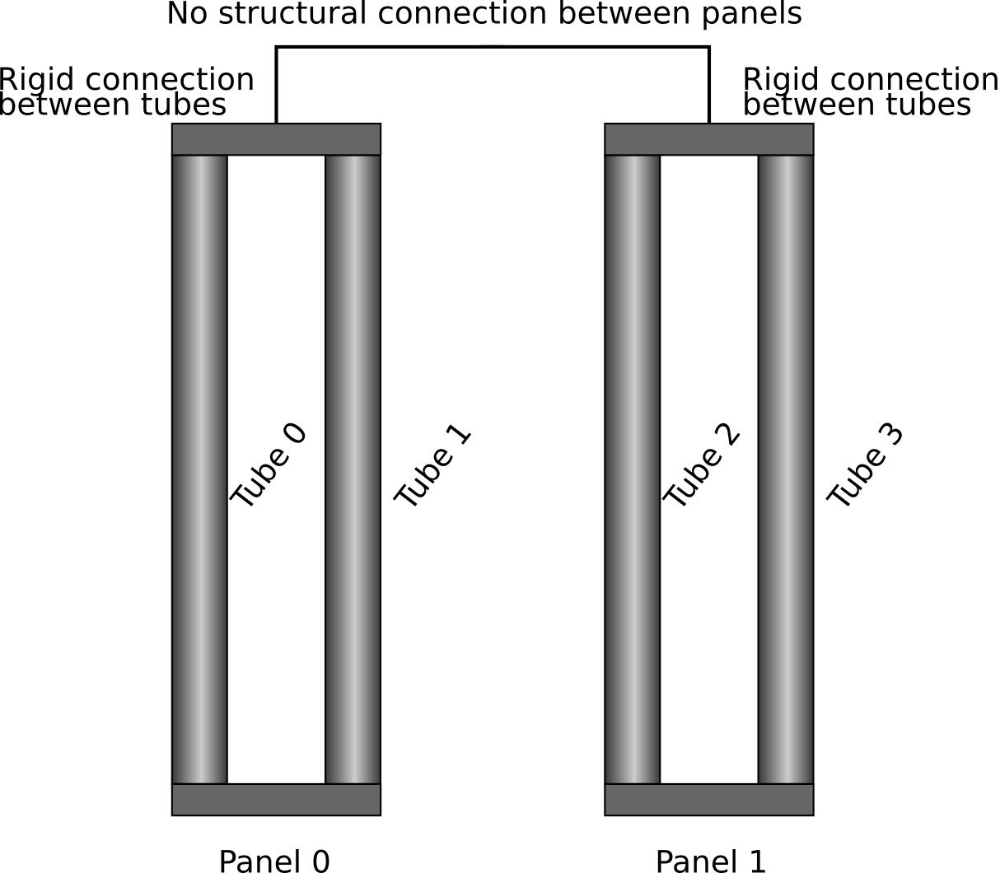
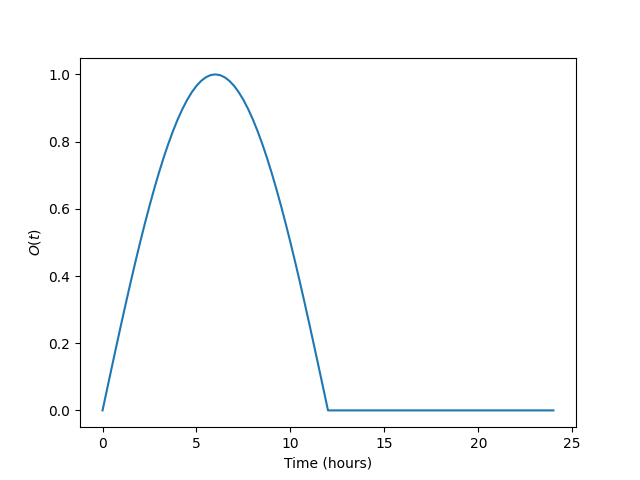
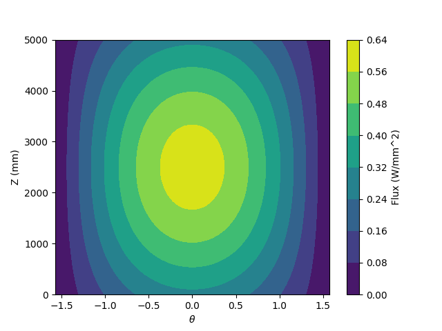

Tutorial: how to use the package
================================

This tutorial guides you through setting up a very simple receiver model
using the python interface, saving the model to an HDF5 file for archiving
and as an example of how to use the file interface to the package,
setting up an analysis, running the analysis, and examining detailed results.
The tutorial assumes you have :any:`installed <installation>` srlife, have a working text editor,
and can run python programs from the command line.  The example commands
here are for Ubuntu Linux, but the step-by-step directions are similar
for any operating system.

The files produced by this tutorial are available in the full srlife 
source package, which can be obtained via git:

.. code-block:: console

   git clone https://github.com/Argonne-National-Laboratory/srlife.git
   cd srlife

The files are in the `examples/tutorial` directory.  *Obtaining the files
is not necessary as this tutorial will walk you through creating the
files and output data available in that source directory.*

In the following sections python code can either be entered directly into
the python interpretor (recall srlife uses `python3`) or entered into a script
and run to see the results.  The example assumes the user creates two
python scripts: 

   1. `setup_problem.py` to build the model and write it to an HDF5 file.
   2. `run_problem.py` to actually run the analysis.

Receiver geometry, loading, and materials
-----------------------------------------

The following image describes the very simple receiver used in this example:

The receiver has two panels each with two tubes.  This is (of course) not a
realistic configuration, but setup to ensure the life estimation only takes
a short period of time, even for a full 3D analysis.

Tube are all geometrically the same with an outer radius of :math:`r_o=12.7` mm, a 
thickness of :math:`s=1.0` mm, and a height of :math:`h=5000` mm.  The problem applies a 
fairly coarse discretization of 12 radial divisions, 20 circumferential divisions,
and 10 axial divisions.  Each structural finite element problem then has around
6000 degrees of freedom, which is not a trivially small amount for full 
incremental 3D analysis.

The two tubes in each individual panel are rigidly connected through their
top-surface displacements.  The two panels are completely structurally
disconnected.

The thermal boundary conditions are an incident flux on the tube outer diameter and convective heat transfer on the inner diameter
resulting from heat transfer molten salt flowing through the receiver.  
The two tubes per panel in the model represent 50 actual tubes (so 100 tubes per panel) in the receiver.
The tubes also
experience a time varying inner pressure.

The analysis encompasses a single, representative day of 24 hours.  The
boundary conditions are built up from simpler functions mathematical functions.
In a real analysis this information would come from other simulation 
software, rather than an exact mathematical description.

The boundary conditions use the function

.. math::

   A(t) = \sin \left( \frac{\pi t}{12} \right)

   O(t) = \frac{1 + \operatorname{sign}(A(t))}{2} A(t)

to describe when the receiver is operating (for 12 hours) or in a
standby condition overnight.  This function looks like this

which describes a gradual ramp up to and down from the peak solar conditions
followed by 12 hours at some standby condition.

The incident flux on the tube outside diameter is then described by the composite function

.. math::

   h_\theta (\theta) = \cos \theta

   h_z(z) = \frac{1+\sin(\pi z / h)}{2}

   h(t,\theta,z) = h_{max} O(t) h_\theta(\theta) h_z(z) h_{tube}

This example uses :math:`h_{max} = 0.6` W/mm\ :superscript:`2` and
:math:`h_0 = 1.0`, :math:`h_1 = 0.8`, :math:`h_2 = 0.6`, :math:`h_3 = 0.4` for
each of the four tubes.
The figure below plots the :math:`\theta = [-\pi/2, \pi/2]` interval of the 
incident flux for tube 0 at the peak flux (:math:`t=6` hours).

Heat transfers from the incident flux, through the receiver tubes, and into
molten salt flowing at a constant mass flow rate of 500 kg/s with an inlet
temperature of 550 C.  The two panels are in a single flow path, salt flows
through one panel and then into the next.

Finally, the internal pressure in all four tubes is the same and given by

.. math::

   p(t) = p_{max} O(t)

with :math:`p_{max} = 1` MPa.

In the example the tube material is 316H stainless steel and the working fluid is 
32MgCL2-68KCl chloride salt.

Defining the receiver geometry and loading conditions
-----------------------------------------------------

The tutorial assumes the following python code is entered into a script
called `setup_problem.py`.

The first requirement is to import the required modules from the srlife
package along with numpy:

.. code:: python

   import numpy as np
   from srlife import receiver

The first step is to setup the :any:`srlife.receiver.Receiver` object
which contains all the information about the receiver loading, geometry, 
and analysis cycle.  This information can be written to an HDF5 file for
archiving and then read back in to complete an analysis.  The
receiver geometry and loading is independent of the tube material, which
can then be easily changed to explore different receiver materials.

First define some basic information about the receiver loading cycle,
setup currently-empty receiver and panel objects to receive the individual
tube information, and define the structural connections between
panels in the receiver and tubes in a panel:

.. code:: python

  # Setup the base receiver
  period = 24.0 # Loading cycle period, hours
  days = 1 # Number of cycles represented in the problem 
  panel_stiffness = "disconnect" # Panels are disconnected from one another

  model = receiver.Receiver(period, days, panel_stiffness)

  # Setup each of the two panels
  tube_stiffness = "rigid"
  panel_0 = receiver.Panel(tube_stiffness)
  panel_1 = receiver.Panel(tube_stiffness)

The following code then defines the variables needed to specify the receiver
geometry and discretization as well as the Python implementation of the 
mathematical functions describing the receiver boundary conditions, defined
in the previous section

.. code:: python

  # Basic receiver geometry
  r_outer = 12.7 # mm
  thickness = 1.0 # mm
  height = 5000.0 # mm

  # Tube discretization
  nr = 12
  nt = 20
  nz = 10

  # Mathematical definition of the tube boundary conditions
  # Function used to define daily operating cycle 
  onoff_base = lambda t: np.sin(np.pi*t/12.0)
  onoff = lambda t: (1+np.sign(onoff_base(t)))/2 * onoff_base(t)
  # Max flux
  h_max = 0.6 # W/mm^2 (which is also MW/m^2)
  # Flux circumferential component
  h_circ = lambda theta: np.cos(theta)
  # Flux axial component
  h_axial = lambda z: (1+np.sin(np.pi*z/height))/2
  # Total flux function
  h_flux = lambda time, theta, z: onoff(time) * h_max * h_circ(theta) * h_axial(z)
  
  # Flux multipliers for each tube
  h_tube_0 = 1.0
  h_tube_1 = 0.8
  h_tube_2 = 0.6
  h_tube_3 = 0.4

  # Both panels are in the same flow path with constant mass flow rate
  # of 500 kg/s and an inlet temperature of 550 C
  mass_flow = 500 * 3600.0
  inlet_temp = 550.0 + 273.15

  # Tubes start at 300 K
  T_base = 300.0

  # For the thermohydraulic calculation, each tube in the model represents 
  # 50 tubes in the actual receiver
  tube_multiplier = 50

  # ID pressure history
  p_max = 1.0 # MPa
  pressure = lambda t: p_max * onoff(t)

srlife takes boundary condition information at *discrete* time intervals.
This allows the software to interface with system thermohydraulic codes that
may produce discrete temperature and pressure information.  In this example
we'll provide the boundary condition information at uniformly-spaced times
throughout the 24 hour cycle:

.. code:: python

   # Time increments throughout the 24 hour day
   times = np.linspace(0,24,24*2+1)

Similarly, the spatial information about the flux 
conditions must be defined over discrete grid points in cylindrical coordinates.
srlife uses the `"ij"` indexing scheme defined in `numpy <https://numpy.org/doc/stable/reference/generated/numpy.meshgrid.html>`_, where the individual 
coordinate arrays are indexed with a matrix scheme:

.. code:: python
   
  # A surface mesh over the outer surface (for the flux)
  time_s, theta_s, z_s = np.meshgrid(times, np.linspace(0,2*np.pi,nt+1)[:nt],
      np.linspace(0,height,nz), indexing = 'ij')

Each individual tube can be defined in terms of its geometry,
discretization, and boundary conditions.  The first tube is defined like this:

.. code:: python

   # Setup each tube in turn and assign it to the correct panel
   # Tube 0
   tube_0 = receiver.Tube(r_outer, thickness, height, nr, nt, nz, T0 = T_base)
   tube_0.set_times(times)
   tube_0.set_bc(receiver.HeatFluxBC(r_outer, height,
       nt, nz, times, h_flux(time_s, theta_s, z_s) * h_tube_0), "outer")
   tube_0.set_pressure_bc(receiver.PressureBC(times, pressure(times)))
   tube_0.multiplier_val = tube_multiplier

The remainder of the tubes are defined similarly:

.. code:: python
   
    # Tube 1
    tube_1 = receiver.Tube(r_outer, thickness, height, nr, nt, nz, T0 = T_base)
    tube_1.set_times(times)
    tube_1.set_bc(receiver.HeatFluxBC(r_outer, height,
        nt, nz, times, h_flux(time_s, theta_s, z_s) * h_tube_1), "outer")
    tube_1.set_pressure_bc(receiver.PressureBC(times, pressure(times)))
    tube_1.multiplier_val = tube_multiplier

    # Tube 2
    tube_2 = receiver.Tube(r_outer, thickness, height, nr, nt, nz, T0 = T_base)
    tube_2.set_times(times)
    tube_2.set_bc(receiver.HeatFluxBC(r_outer, height,
        nt, nz, times, h_flux(time_s, theta_s, z_s) * h_tube_2), "outer")
    tube_2.set_pressure_bc(receiver.PressureBC(times, pressure(times)))
    tube_2.multiplier_val = tube_multiplier

    # Tube 3
    tube_3 = receiver.Tube(r_outer, thickness, height, nr, nt, nz, T0 = T_base)
    tube_3.set_times(times)
    tube_3.set_bc(receiver.HeatFluxBC(r_outer, height,
        nt, nz, times, h_flux(time_s, theta_s, z_s) * h_tube_3), "outer")
    tube_3.set_pressure_bc(receiver.PressureBC(times, pressure(times)))
    tube_3.multiplier_val = tube_multiplier

Each tube must be added to the relevant panel and the panels
to the receiver:

.. code:: python

  # Assign to panel 0
  panel_0.add_tube(tube_0, "tube0")
  panel_0.add_tube(tube_1, "tube1")

  # Assign to panel 1
  panel_1.add_tube(tube_2, "tube2")
  panel_1.add_tube(tube_3, "tube3")

  # Assign the panels to the receiver
  model.add_panel(panel_0, "panel0")
  model.add_panel(panel_1, "panel1")

Finally, the single flow path through both panels must be defined

.. code:: python

    # Assign each panel to the flow path with the appropriate inlet temperatures
    # and mass flow rates
    model.add_flowpath(["panel0", "panel1"],
                       times,
                       np.ones_like(times) * mass_flow,
                       np.ones_like(times) * inlet_temp)

At this point the :any:`srlife.receiver.Receiver` object is fully-defined
and ready to be used in a life assessment.  However, for this tutorial
instead save the receiver to disk for later use:

.. code:: python 
   
  # Save the receiver to an HDF5 file
  model.save("model.hdf5")

Assuming you save this script as `setup_problem.py` running it with

.. code:: console

   python setup_problem.py

will produce a file called `model.hdf5` which saves all the information
described above for later use.

The key point of this rather lengthy script is that *actual users of the srlife
should never have to write a script like this explictly defining the receiver
boundary conditions.*  Instead this information should be obtained from some
upstream plant and heliostat analysis systems.  The
user would then write interface code either directly in Python or using the
HDF5 file format as an intermediary to transfer the information into srlife.

Defining the analysis material models and analysis parameters
-------------------------------------------------------------

The remainder of the information needed to estimate the life of the
receiver defined above is:

   1. What material the receiver is constructed from to define suitable thermal, structural, and damage models.
   2. The working fluid properties to simulate convective heat transfer.
   3. *How* to solve the thermal, structural, and damage analysis simulations required to estimate the life of the component.

The following assumes the user makes a new Python script called `run_problem.py` to define this additional information and run the analysis.

First load the required modules from srlife and, again, the numpy library to
help with some mathematics:

.. code:: python

   import numpy as np
   from srlife import receiver, solverparams, library, thermal, structural, system, damage, managers

The script must first load the receiver, defined in the previous section,
from the HDF5 file for reuse:

.. code:: python

  # Load the receiver we previously saved
  model = receiver.Receiver.load("model.hdf5")

srlife maintains a :any:`library <materials>` of material models for
several metallic receivers and working fluids.  Standard models can
be loaded from the this library for use in the analysis

.. code:: python

  # Choose the material models
  fluid_mat = library.load_thermal_fluid("32MgCl2-68KCl", "base") 
  # Base 316H thermal and damage models, a simplified deformation model to 
  # cut down on the run time of the 3D analysis
  thermal_mat, deformation_mat, damage_mat = library.load_material("316H", "base", "elastic_creep", "base")

This example uses the `"base"` representations of the chloride salt and 316H
models, except for a simplified structural model to help cut down on analysis
time.

The user must then tell srlife *how* to solve the problem. This might involve some simplification of the full 3D problem and  requires
defining thermal, single-tube structural, system structural, and damage solvers
as well as a set of solution parameters.

The tutorial reduces the analysis (thermal and structural) to one dimension
to make the resulting thermal/structural analysis run essentially instantaneously:

.. code:: python

  # Cut down on run time for now by making the tube analyses 1D
  # This is not recommended for actual design evaluation
  for panel in model.panels.values():
    for tube in panel.tubes.values():
      tube.make_1D(tube.h/2, 0)

The follow then defines numerical solver parameters and the actual thermohydraulic,
structural, and damage solvers to use in the problem.

.. code:: python

    # Setup some solver parameters
    params = solverparams.ParameterSet()
    params['progress_bars'] = True # Print a progress bar to the screen as we solve
    params['nthreads'] = 4 # Solve will run in multithreaded mode, set to number of available cores
    params['system']['atol'] = 1.0e-4 # During the standby very little happens, lower the atol to accept this result

    # Choose the solvers, i.e. how we are going to solve the thermal,
    # single tube, structural system, and damage calculation problems.
    # Define the thermal solver to use in solving the heat transfer problem
    thermal_solver = thermal.ThermohydraulicsThermalSolver(params["thermal"])
    # Define the structural solver to use in solving the individual tube problems
    structural_solver = structural.PythonTubeSolver(params["structural"])
    # Define the system solver to use in solving the coupled structural system
    system_solver = system.SpringSystemSolver(params["system"])
    # Damage model to use in calculating life
    damage_model = damage.TimeFractionInteractionDamage(params["damage"])

The user might consider changing the `params['nthreads']` parameter to match
the number of cores on their machine, to speed up the analysis.
   
Running the life estimation analysis
------------------------------------

With the problem fully defined a solution manager can be setup to manage the
thermal, structural, and damage solves and to complete the life estimation.
Finally, the analysis can be run and the life of the receiver estimated:

.. code:: python

    # The solution manager
    solver = managers.SolutionManager(model, thermal_solver, thermal_mat, fluid_mat,
            structural_solver, deformation_mat, damage_mat,
            system_solver, damage_model, pset = params)

    # Actually solve for life
    life = solver.solve_life()
    print("Best estimate life: %f daily cycles" % life)

If the `params['progress_bars']` parameter is kept as `True` then the program
will print a status bar representing its progress along each individual step
(thermal, structural, and damage).  Finally, the program should output:

.. code:: console

   Best estimate life: 7077.239061 daily cycles

indicating that the module predicts this receiver to have a structural life of
around 7000 repetitions of the daily cycle, or about 20 years. 

Visualizing tube results
------------------------

Optionally, the user can output the full, temporal and spatial tube results
to a VTK file for additional postprocessing:

.. code:: python

  # Save the tube data out for additional visualization
  for pi, panel in model.panels.items():
    for ti, tube in panel.tubes.items():
      tube.write_vtk("tube-%s-%s" % (pi, ti))

This command produces a series of `VTK <https://vtk.org/>`_ files (one per tube per time step) containing the full
thermal, structural, and damage results.  These files can be visualized
with a program like `ParaView <https://www.paraview.org/>`_.
